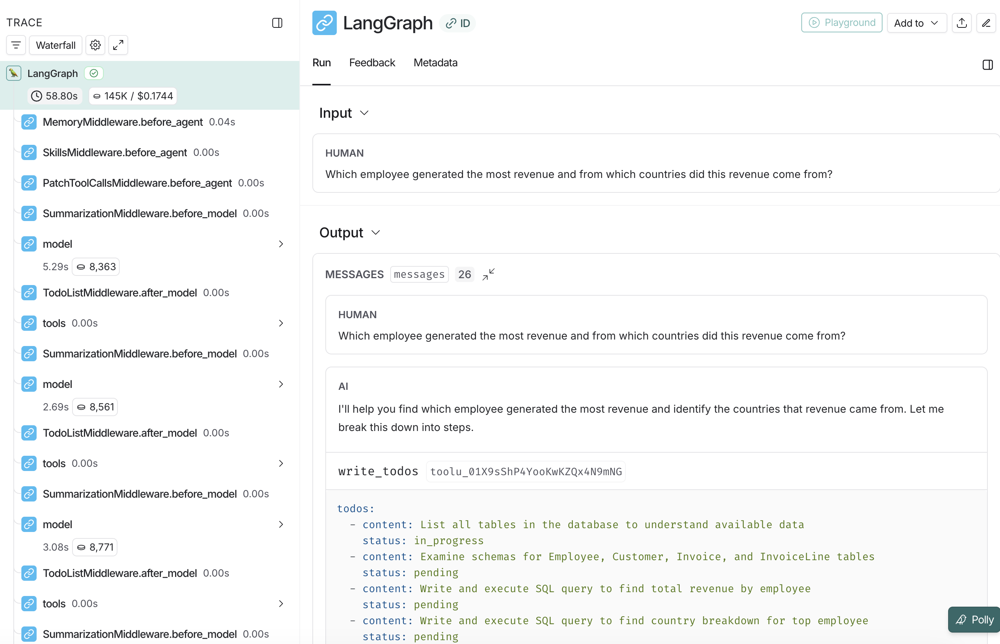

# Text-to-SQL Deep Agent

A natural language to SQL query agent powered by LangChain's **Deep Agents** framework.  This is an advanced version of a text-to-SQL agent with planning, filesystem, and subagent capabilities.

## What is Deep Agents?

Deep Agents is a sophisticated agent framework built on LangGraph that provides:

- **Planning capabilities** - Break down complex tasks with `write_todos` tool
- **Filesystem backend** - Save and retrieve context with file operations
- **Subagent spawning** - Delegate specialized tasks to focused agents
- **Context management** - Prevent context window overflow on complex tasks

## Demo Database

Uses the [Chinook database](https://github.com/lerocha/chinook-database) - a sample database representing a digital media store.

## Quick Start

### Prerequisites

- Python 3.11 or higher
- Anthropic API key ([get one here](https://console.anthropic.com/))
- (Optional) LangSmith API key for tracing ([sign up here](https://smith.langchain.com/))

### Installation

1. Clone the deepagents repository and navigate to this example:

```bash
git clone https://github.com/langchain-ai/deepagents.git
cd deepagents/examples/text-to-sql-agent
```

1. Download the Chinook database:

```bash
# Download the SQLite database file
curl -L -o chinook.db https://github.com/lerocha/chinook-database/raw/master/ChinookDatabase/DataSources/Chinook_Sqlite.sqlite
```

1. Create a virtual environment and install dependencies:

```bash
# Using uv (recommended)
uv venv --python 3.11
source .venv/bin/activate  # On Windows: .venv\Scripts\activate
uv pip install -e .
```

1. Set up your environment variables:

```bash
cp .env.example .env
# Edit .env and add your API keys
```

Required in `.env`:

```
ANTHROPIC_API_KEY=your_anthropic_api_key_here
```

Optional:

```
LANGCHAIN_TRACING_V2=true
LANGSMITH_ENDPOINT=https://api.smith.langchain.com
LANGCHAIN_API_KEY=your_langsmith_api_key_here
LANGCHAIN_PROJECT=text2sql-deepagent
```

## Usage

### Command Line Interface

Run the agent from the command line with a natural language question:

```bash
python agent.py "What are the top 5 best-selling artists?"
```

```bash
python agent.py "Which employee generated the most revenue by country?"
```

```bash
python agent.py "How many customers are from Canada?"
```

### Programmatic Usage

You can also use the agent in your Python code:

```python
from agent import create_sql_deep_agent

# Create the agent
agent = create_sql_deep_agent()

# Ask a question
result = agent.invoke({
    "messages": [{"role": "user", "content": "What are the top 5 best-selling artists?"}]
})

print(result["messages"][-1].content)
```

## How the Deep Agent Works

### Architecture

```
User Question
     ↓
Deep Agent (with planning)
     ├─ write_todos (plan the approach)
     ├─ SQL Tools
     │  ├─ list_tables
     │  ├─ get_schema
     │  ├─ query_checker
     │  └─ execute_query
     ├─ Filesystem Tools (optional)
     │  ├─ ls
     │  ├─ read_file
     │  ├─ write_file
     │  └─ edit_file
     └─ Subagent Spawning (optional)
     ↓
SQLite Database (Chinook)
     ↓
Formatted Answer
```

### Configuration

Deep Agents uses **progressive disclosure** with memory files and skills:

**AGENTS.md** (always loaded) - Contains:

- Agent identity and role
- Core principles and safety rules
- General guidelines
- Communication style

**skills/** (loaded on-demand) - Specialized workflows:

- **query-writing** - How to write and execute SQL queries (simple and complex)
- **schema-exploration** - How to discover database structure and relationships

The agent sees skill descriptions in its context but only loads the full SKILL.md instructions when it determines which skill is needed for the current task. This **progressive disclosure** pattern keeps context efficient while providing deep expertise when needed.

## Example Queries

### Simple Query

```
"How many customers are from Canada?"
```

The agent will directly query and return the count.

### Complex Query with Planning

```
"Which employee generated the most revenue and from which countries?"
```

The agent will:

1. Use `write_todos` to plan the approach
2. Identify required tables (Employee, Invoice, Customer)
3. Plan the JOIN structure
4. Execute the query
5. Format results with analysis

## Deep Agent Output Example

The Deep Agent shows its reasoning process:

```
Question: Which employee generated the most revenue by country?

[Planning Step]
Using write_todos:
- [ ] List tables in database
- [ ] Examine Employee and Invoice schemas
- [ ] Plan multi-table JOIN query
- [ ] Execute and aggregate by employee and country
- [ ] Format results

[Execution Steps]
1. Listing tables...
2. Getting schema for: Employee, Invoice, InvoiceLine, Customer
3. Generating SQL query...
4. Executing query...
5. Formatting results...

[Final Answer]
Employee Jane Peacock (ID: 3) generated the most revenue...
Top countries: USA ($1000), Canada ($500)...
```

## Project Structure

```
text-to-sql-agent/
├── agent.py                      # Core Deep Agent implementation with CLI
├── AGENTS.md                     # Agent identity and general instructions (always loaded)
├── skills/                       # Specialized workflows (loaded on-demand)
│   ├── query-writing/
│   │   └── SKILL.md             # SQL query writing workflow
│   └── schema-exploration/
│       └── SKILL.md             # Database structure discovery workflow
├── chinook.db                    # Sample SQLite database (downloaded, gitignored)
├── pyproject.toml                # Project configuration and dependencies
├── uv.lock                       # Locked dependency versions
├── .env.example                  # Environment variable template
├── .gitignore                    # Git ignore rules
├── text-to-sql-langsmith-trace.png  # LangSmith trace example image
└── README.md                     # This file
```

## Requirements

All dependencies are specified in `pyproject.toml`:

- deepagents >= 0.3.5
- langchain >= 1.2.3
- langchain-anthropic >= 1.3.1
- langchain-community >= 0.3.0
- langgraph >= 1.0.6
- sqlalchemy >= 2.0.0
- python-dotenv >= 1.0.0
- tavily-python >= 0.5.0
- rich >= 13.0.0

## LangSmith Integration

### Setup

1. Sign up for a free account at [LangSmith](https://smith.langchain.com/)
2. Create an API key from your account settings
3. Add these variables to your `.env` file:

```
LANGCHAIN_TRACING_V2=true
LANGSMITH_ENDPOINT=https://api.smith.langchain.com
LANGCHAIN_API_KEY=your_langsmith_api_key_here
LANGCHAIN_PROJECT=text2sql-deepagent
```

### What You'll See

When configured, every query is automatically traced:



You can view:

- Complete execution trace with all tool calls
- Planning steps (write_todos)
- Filesystem operations
- Token usage and costs
- Generated SQL queries
- Error messages and retry attempts

View your traces at: <https://smith.langchain.com/>

## Resources

- [Deep Agents Documentation](https://docs.langchain.com/oss/python/deepagents/overview)
- [LangChain](https://www.langchain.com/)
- [Claude Sonnet 4.5](https://www.anthropic.com/claude)
- [Chinook Database](https://github.com/lerocha/chinook-database)

## License

MIT

## Contributing

Contributions are welcome! Please feel free to submit a Pull Request.
