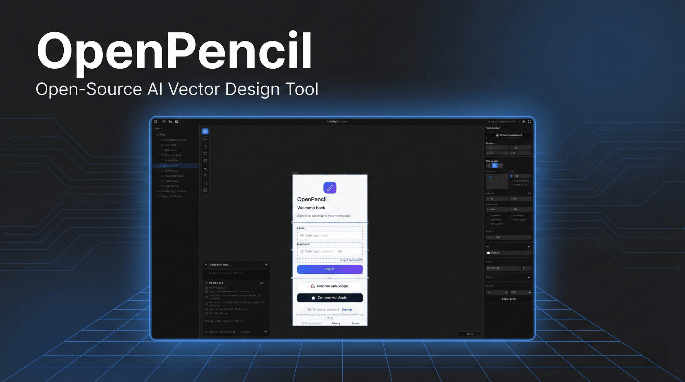

<p align="center">
  
</p>

<h1 align="center">OpenPencil</h1>

<p align="center">
  <strong>Công cụ thiết kế vector mã nguồn mở thuần AI đầu tiên trên thế giới.</strong><br />
  <sub>Đội Tác nhân Đồng thời &bull; Design-as-Code &bull; Máy chủ MCP Tích hợp &bull; Trí tuệ Đa mô hình</sub>
</p>

<p align="center">
  <a href="./README.md"><b>English</b></a> · <a href="./README.zh.md">简体中文</a> · <a href="./README.zh-TW.md">繁體中文</a> · <a href="./README.ja.md">日本語</a> · <a href="./README.ko.md">한국어</a> · <a href="./README.fr.md">Français</a> · <a href="./README.es.md">Español</a> · <a href="./README.de.md">Deutsch</a> · <a href="./README.pt.md">Português</a> · <a href="./README.ru.md">Русский</a> · <a href="./README.hi.md">हिन्दी</a> · <a href="./README.tr.md">Türkçe</a> · <a href="./README.th.md">ไทย</a> · <a href="./README.vi.md">Tiếng Việt</a> · <a href="./README.id.md">Bahasa Indonesia</a>
</p>

<p align="center">
  <a href="https://github.com/ZSeven-W/openpencil/stargazers"></a>
  <a href="https://github.com/ZSeven-W/openpencil/blob/main/LICENSE"></a>
  <a href="https://github.com/ZSeven-W/openpencil/actions/workflows/ci.yml"></a>
  <a href="https://discord.gg/h9Fmyy6pVh"></a>
</p>

<br />

<p align="center">
  <a href="https://oss.ioa.tech/zseven/openpencil/a46e24733239ce24de36702342201033.mp4">
    
  </a>
</p>
<p align="center"><sub>Nhấp vào hình ảnh để xem video demo</sub></p>

<br />

> **Lưu ý:** Có một dự án mã nguồn mở khác cùng tên — [OpenPencil](https://github.com/open-pencil/open-pencil), tập trung vào thiết kế trực quan tương thích Figma với cộng tác thời gian thực. Dự án này tập trung vào quy trình AI-native từ thiết kế sang mã.

## Tại sao chọn OpenPencil

<table>
<tr>
<td width="50%">

### 🎨 Prompt → Canvas

Mô tả bất kỳ giao diện nào bằng ngôn ngữ tự nhiên. Xem nó xuất hiện trên canvas vô hạn theo thời gian thực với hiệu ứng streaming. Chỉnh sửa thiết kế hiện có bằng cách chọn các phần tử và trò chuyện.

</td>
<td width="50%">

### 🤖 Đội Tác nhân Đồng thời

Bộ điều phối phân rã các trang phức tạp thành các tác vụ con theo không gian. Nhiều tác nhân AI làm việc trên các phần khác nhau đồng thời — hero, features, footer — tất cả streaming song song.

</td>
</tr>
<tr>
<td width="50%">

### 🧠 Trí tuệ Đa mô hình

Tự động thích ứng với khả năng của từng mô hình. Claude nhận prompt đầy đủ với thinking; GPT-4o/Gemini tắt thinking; các mô hình nhỏ hơn (MiniMax, Qwen, Llama) nhận prompt đơn giản hóa cho đầu ra đáng tin cậy.

</td>
<td width="50%">

### 🔌 Máy chủ MCP

Cài đặt một cú nhấp vào Claude Code, Codex, Gemini, OpenCode, Kiro hoặc Copilot CLI. Thiết kế từ terminal — đọc, tạo và chỉnh sửa tệp `.op` thông qua bất kỳ tác nhân tương thích MCP nào.

</td>
</tr>
<tr>
<td width="50%">

### 📦 Design-as-Code

Tệp `.op` là JSON — dễ đọc, thân thiện Git, dễ so sánh khác biệt. Biến thiết kế tạo ra thuộc tính tùy chỉnh CSS. Xuất mã sang React + Tailwind hoặc HTML + CSS.

</td>
<td width="50%">

### 🖥️ Chạy Mọi nơi

Ứng dụng web + desktop gốc trên macOS, Windows và Linux qua Electron. Tự động cập nhật từ GitHub Releases. Liên kết tệp `.op` — nhấp đúp để mở.

</td>
</tr>
<tr>
<td width="50%">

### ⌨️ CLI — `op`

Điều khiển công cụ thiết kế từ terminal của bạn. `op design`, `op insert`, `op export` — batch design DSL, thao tác node, xuất mã. Pipe từ tệp hoặc stdin. Hoạt động với ứng dụng desktop hoặc web server.

</td>
<td width="50%">

### 🎯 Xuất mã Đa nền tảng

Xuất từ một tệp `.op` duy nhất sang React + Tailwind, HTML + CSS, Vue, Svelte, Flutter, SwiftUI, Jetpack Compose, React Native. Biến thiết kế trở thành thuộc tính tùy chỉnh CSS.

</td>
</tr>
</table>

## Bắt đầu nhanh

```bash
# Cài đặt các phụ thuộc
bun install

# Khởi động máy chủ phát triển tại http://localhost:3000
bun --bun run dev
```

Hoặc chạy dưới dạng ứng dụng desktop:

```bash
bun run electron:dev
```

> **Yêu cầu:** [Bun](https://bun.sh/) >= 1.0 và [Node.js](https://nodejs.org/) >= 18

### Docker

Có nhiều biến thể image khác nhau — chọn loại phù hợp với nhu cầu của bạn:

| Image | Kích thước | Bao gồm |
| --- | --- | --- |
| `openpencil:latest` | ~226 MB | Chỉ ứng dụng web |
| `openpencil-claude:latest` | — | + Claude Code CLI |
| `openpencil-codex:latest` | — | + Codex CLI |
| `openpencil-opencode:latest` | — | + OpenCode CLI |
| `openpencil-copilot:latest` | — | + GitHub Copilot CLI |
| `openpencil-gemini:latest` | — | + Gemini CLI |
| `openpencil-full:latest` | ~1 GB | Tất cả công cụ CLI |

**Chạy (chỉ web):**

```bash
docker run -d -p 3000:3000 ghcr.io/zseven-w/openpencil:latest
```

**Chạy với AI CLI (ví dụ Claude Code):**

Chat AI dựa vào đăng nhập OAuth của Claude CLI. Sử dụng Docker volume để lưu phiên đăng nhập:

```bash
# Bước 1 — Đăng nhập (một lần)
docker volume create openpencil-claude-auth
docker run -it --rm \
  -v openpencil-claude-auth:/root/.claude \
  ghcr.io/zseven-w/openpencil-claude:latest claude login

# Bước 2 — Khởi động
docker run -d -p 3000:3000 \
  -v openpencil-claude-auth:/root/.claude \
  ghcr.io/zseven-w/openpencil-claude:latest
```

**Build cục bộ:**

```bash
# Cơ bản (chỉ web)
docker build --target base -t openpencil .

# Với một CLI cụ thể
docker build --target with-claude -t openpencil-claude .

# Đầy đủ (tất cả CLI)
docker build --target full -t openpencil-full .
```

## Thiết kế thuần AI

**Từ Prompt đến Giao diện**
- **Văn bản thành thiết kế** — mô tả một trang, nhận kết quả được tạo ra trên canvas theo thời gian thực với hiệu ứng streaming
- **Orchestrator** — phân rã các trang phức tạp thành các tác vụ con không gian để tạo song song
- **Chỉnh sửa thiết kế** — chọn các phần tử, sau đó mô tả thay đổi bằng ngôn ngữ tự nhiên
- **Đầu vào hình ảnh** — đính kèm ảnh chụp màn hình hoặc bản phác thảo để thiết kế dựa trên tham chiếu

**Hỗ trợ Đa tác nhân**

| Tác nhân | Cài đặt |
| --- | --- |
| **Tích hợp sẵn (9+ nhà cung cấp)** | Chọn từ các preset nhà cung cấp với bộ chuyển đổi khu vực — Anthropic, OpenAI, Google, DeepSeek và nhiều hơn |
| **Claude Code** | Không cần cấu hình — sử dụng Claude Agent SDK với OAuth cục bộ |
| **Codex CLI** | Kết nối trong Cài đặt tác nhân (`Cmd+,`) |
| **OpenCode** | Kết nối trong Cài đặt tác nhân (`Cmd+,`) |
| **GitHub Copilot** | `copilot login` rồi kết nối trong Cài đặt tác nhân (`Cmd+,`) |
| **Gemini CLI** | Kết nối trong Cài đặt tác nhân (`Cmd+,`) |

**Hồ sơ Năng lực Mô hình** — tự động thích ứng prompt, chế độ thinking và thời gian chờ theo từng cấp mô hình. Mô hình cấp đầy đủ (Claude) nhận prompt hoàn chỉnh; cấp tiêu chuẩn (GPT-4o, Gemini, DeepSeek) tắt thinking; cấp cơ bản (MiniMax, Qwen, Llama, Mistral) nhận prompt JSON lồng nhau đơn giản hóa để đảm bảo độ tin cậy tối đa.

**i18n** — Bản địa hóa giao diện đầy đủ bằng 15 ngôn ngữ: English, 简体中文, 繁體中文, 日本語, 한국어, Français, Español, Deutsch, Português, Русский, हिन्दी, Türkçe, ไทย, Tiếng Việt, Bahasa Indonesia.

**Máy chủ MCP**
- Máy chủ MCP tích hợp sẵn — cài đặt một cú nhấp vào Claude Code / Codex / Gemini / OpenCode / Kiro / Copilot CLI
- Tự động phát hiện Node.js — nếu chưa cài đặt, tự động chuyển sang HTTP transport và khởi động MCP HTTP server
- Tự động hóa thiết kế từ terminal: đọc, tạo và chỉnh sửa các tệp `.op` qua bất kỳ tác nhân tương thích MCP nào
- **Quy trình thiết kế phân lớp** — `design_skeleton` → `design_content` → `design_refine` cho thiết kế đa phần có độ trung thực cao hơn
- **Truy xuất prompt phân đoạn** — chỉ tải kiến thức thiết kế cần thiết (schema, layout, roles, icons, planning, v.v.)
- Hỗ trợ nhiều trang — tạo, đổi tên, sắp xếp lại và nhân bản trang qua các công cụ MCP

**Tạo mã nguồn**
- React + Tailwind CSS, HTML + CSS, CSS Variables
- Vue, Svelte, Flutter, SwiftUI, Jetpack Compose, React Native

## CLI — `op`

Cài đặt toàn cục và điều khiển công cụ thiết kế từ terminal của bạn:

```bash
npm install -g @zseven-w/openpencil
```

```bash
op start                     # Khởi chạy ứng dụng desktop
op design @landing.txt       # Thiết kế hàng loạt từ tệp
op insert '{"type":"RECT"}'  # Chèn một node
op export react --out .      # Xuất sang React + Tailwind
op import:figma design.fig   # Nhập tệp Figma
cat design.dsl | op design - # Pipe từ stdin
```

Hỗ trợ ba phương thức nhập liệu: chuỗi inline, `@filepath` (đọc từ tệp), hoặc `-` (đọc từ stdin). Hoạt động với ứng dụng desktop hoặc web dev server. Xem [CLI README](./apps/cli/README.md) để biết đầy đủ các lệnh.

**LLM Skill** — cài đặt plugin [OpenPencil Skill](https://github.com/ZSeven-W/openpencil-skill) để dạy AI agent (Claude Code, Cursor, Codex, Gemini CLI, v.v.) thiết kế bằng `op`.

## Tính năng

**Canvas và Vẽ**
- Canvas vô hạn với pan, zoom, hướng dẫn căn chỉnh thông minh và snapping
- Hình chữ nhật, Hình ellipse, Đường thẳng, Đa giác, Bút (Bezier), Frame, Văn bản
- Phép toán Boolean — hợp nhất, trừ, giao nhau với thanh công cụ ngữ cảnh
- Trình chọn icon (Iconify) và nhập hình ảnh (PNG/JPEG/SVG/WebP/GIF)
- Auto-layout — dọc/ngang với gap, padding, justify, align
- Tài liệu nhiều trang với điều hướng bằng tab

**Hệ thống Thiết kế**
- Biến thiết kế — token màu sắc, số, chuỗi với tham chiếu `$variable`
- Hỗ trợ đa chủ đề — nhiều trục, mỗi trục có các biến thể (Sáng/Tối, Thu gọn/Thoải mái)
- Hệ thống component — các component có thể tái sử dụng với instances và overrides
- Đồng bộ CSS — thuộc tính tùy chỉnh tự động tạo, `var(--name)` trong đầu ra mã

**Nhập từ Figma**
- Nhập tệp `.fig` với layout, fills, strokes, effects, văn bản, hình ảnh và vector được bảo toàn

**Ứng dụng Desktop**
- macOS, Windows và Linux gốc qua Electron
- Liên kết tệp `.op` — nhấp đúp để mở, khóa phiên bản đơn
- Tự động cập nhật từ GitHub Releases
- Menu ứng dụng gốc và hộp thoại tệp

## Công nghệ

| | |
| --- | --- |
| **Frontend** | React 19 · TanStack Start · Tailwind CSS v4 · shadcn/ui · i18next |
| **Canvas** | CanvasKit/Skia (WASM, tăng tốc GPU) |
| **Trạng thái** | Zustand v5 |
| **Máy chủ** | Nitro |
| **Desktop** | Electron 35 |
| **CLI** | `op` — điều khiển từ terminal, batch design DSL, xuất mã |
| **AI** | Vercel AI SDK v6 · Anthropic SDK · Claude Agent SDK · OpenCode SDK · Copilot SDK |
| **Runtime** | Bun · Vite 7 |
| **Định dạng tệp** | `.op` — dựa trên JSON, dễ đọc, thân thiện với Git |

## Cấu trúc dự án

```text
openpencil/
├── apps/
│   ├── web/                 Ứng dụng web TanStack Start
│   │   ├── src/
│   │   │   ├── canvas/      Engine CanvasKit/Skia — vẽ, đồng bộ, layout
│   │   │   ├── components/  React UI — editor, panels, hộp thoại dùng chung, icons
│   │   │   ├── services/ai/ AI chat, orchestrator, tạo thiết kế, streaming
│   │   │   ├── stores/      Zustand — canvas, document, pages, history, AI
│   │   │   ├── mcp/         Công cụ máy chủ MCP để tích hợp CLI bên ngoài
│   │   │   ├── hooks/       Phím tắt, kéo thả tệp, dán từ Figma
│   │   │   └── uikit/       Hệ thống kit component có thể tái sử dụng
│   │   └── server/
│   │       ├── api/ai/      Nitro API — streaming chat, generation, validation
│   │       └── utils/       Claude CLI, OpenCode, Codex, Copilot wrappers
│   ├── desktop/             Ứng dụng desktop Electron
│   │   ├── main.ts          Cửa sổ, Nitro fork, menu gốc, auto-updater
│   │   ├── ipc-handlers.ts  Hộp thoại file gốc, đồng bộ theme, tùy chọn IPC
│   │   └── preload.ts       IPC bridge
│   └── cli/                 Công cụ CLI — lệnh `op`
│       ├── src/commands/    Lệnh design, document, export, import, node, page, variable
│       ├── connection.ts    Kết nối WebSocket đến ứng dụng đang chạy
│       └── launcher.ts      Tự động phát hiện và khởi chạy ứng dụng desktop hoặc web server
├── packages/
│   ├── pen-types/           Định nghĩa kiểu cho mô hình PenDocument
│   ├── pen-core/            Thao tác cây tài liệu, layout engine, biến
│   ├── pen-codegen/         Bộ tạo mã (React, HTML, Vue, Flutter, ...)
│   ├── pen-figma/           Trình phân tích và chuyển đổi tệp Figma .fig
│   ├── pen-renderer/        Bộ dựng hình CanvasKit/Skia độc lập
│   ├── pen-sdk/             SDK tổng hợp (tái xuất tất cả các gói)
│   ├── pen-ai-skills/       Engine kỹ năng AI prompt (tải prompt theo giai đoạn)
│   └── agent/               SDK tác nhân AI (Vercel AI SDK, đa nhà cung cấp, đội tác nhân)
└── .githooks/               Pre-commit đồng bộ phiên bản từ tên nhánh
```

## Phím tắt

| Phím | Hành động | | Phím | Hành động |
| --- | --- | --- | --- | --- |
| `V` | Chọn | | `Cmd+S` | Lưu |
| `R` | Hình chữ nhật | | `Cmd+Z` | Hoàn tác |
| `O` | Hình ellipse | | `Cmd+Shift+Z` | Làm lại |
| `L` | Đường thẳng | | `Cmd+C/X/V/D` | Sao chép/Cắt/Dán/Nhân bản |
| `T` | Văn bản | | `Cmd+G` | Nhóm |
| `F` | Frame | | `Cmd+Shift+G` | Bỏ nhóm |
| `P` | Công cụ bút | | `Cmd+Shift+E` | Xuất |
| `H` | Tay (pan) | | `Cmd+Shift+C` | Bảng mã |
| `Del` | Xóa | | `Cmd+Shift+V` | Bảng biến |
| `[ / ]` | Sắp xếp lại | | `Cmd+J` | AI chat |
| Mũi tên | Dịch chuyển 1px | | `Cmd+,` | Cài đặt tác nhân |
| `Cmd+Alt+U` | Hợp nhất Boolean | | `Cmd+Alt+S` | Trừ Boolean |
| `Cmd+Alt+I` | Giao nhau Boolean | | | |

## Scripts

```bash
bun --bun run dev          # Máy chủ phát triển (cổng 3000)
bun --bun run build        # Build production
bun --bun run test         # Chạy kiểm thử (Vitest)
npx tsc --noEmit           # Kiểm tra kiểu
bun run bump <version>     # Đồng bộ phiên bản trên tất cả package.json
bun run electron:dev       # Electron dev
bun run electron:build     # Đóng gói Electron
bun run cli:dev            # Chạy CLI từ mã nguồn
bun run cli:compile        # Biên dịch CLI sang dist
```

## Đóng góp

Chào mừng đóng góp! Xem [CLAUDE.md](./CLAUDE.md) để biết chi tiết về kiến trúc và phong cách mã.

1. Fork và clone
2. Thiết lập đồng bộ phiên bản: `git config core.hooksPath .githooks`
3. Tạo branch: `git checkout -b feat/my-feature`
4. Chạy kiểm tra: `npx tsc --noEmit && bun --bun run test`
5. Commit theo [Conventional Commits](https://www.conventionalcommits.org/): `feat(canvas): add rotation snapping`
6. Mở PR vào nhánh `main`

## Lộ trình

- [x] Biến thiết kế & token với đồng bộ CSS
- [x] Hệ thống component (instances & overrides)
- [x] Tạo thiết kế AI với orchestrator
- [x] Tích hợp máy chủ MCP với quy trình thiết kế phân lớp
- [x] Hỗ trợ nhiều trang
- [x] Nhập Figma `.fig`
- [x] Phép toán Boolean (hợp nhất, trừ, giao)
- [x] Hồ sơ năng lực đa mô hình
- [x] Tái cấu trúc monorepo với các gói tái sử dụng
- [x] Công cụ CLI (`op`) điều khiển từ terminal
- [x] SDK tác nhân AI tích hợp sẵn với hỗ trợ đa nhà cung cấp
- [x] i18n — 15 ngôn ngữ
- [ ] Chỉnh sửa cộng tác
- [ ] Hệ thống plugin

## Người đóng góp

<a href="https://github.com/ZSeven-W/openpencil/graphs/contributors">
  
</a>

## Cộng đồng

<a href="https://discord.gg/h9Fmyy6pVh">
  
  <strong> Tham gia Discord của chúng tôi</strong>
</a>
— Đặt câu hỏi, chia sẻ thiết kế, đề xuất tính năng.

## Star History

<a href="https://star-history.com/#ZSeven-W/openpencil&Date">
 <picture>
   <source media="(prefers-color-scheme: dark)" srcset="https://api.star-history.com/svg?repos=ZSeven-W/openpencil&type=Date&theme=dark" />
   <source media="(prefers-color-scheme: light)" srcset="https://api.star-history.com/svg?repos=ZSeven-W/openpencil&type=Date" />
   
 </picture>
</a>

## Giấy phép

[MIT](./LICENSE) — Copyright (c) 2026 ZSeven-W
